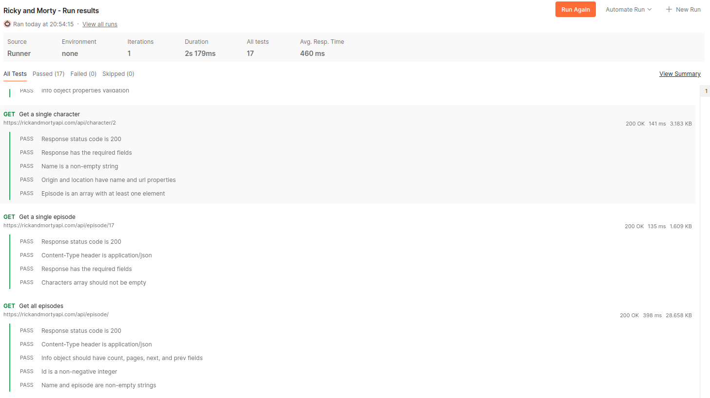
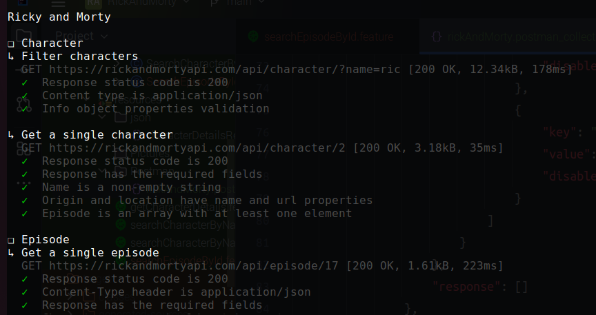
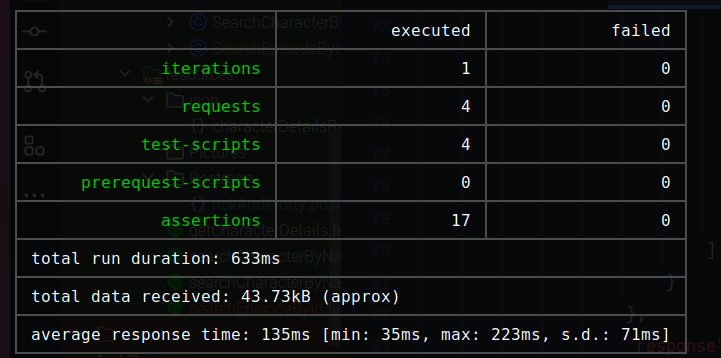

About this repository
==================
This repository contains the final exercise for the course QA & Testing from Hiberus University.

We are working with [Rick and MortyAPI](https://rickandmortyapi.com/) . Here's the [documentation](https://rickandmortyapi.com/documentation/#rest)
of this API.

What do I need to run?
---
A Java 8 JDK, Maven, Cucumber and Rest Assured. That's it!

📮 Postman
---
I have the collection in the folder Postman where there are the needed requests and its validations.

  Generation of tests in each call to verify that it has been executed correctly.
  

  Then we run the collection on Newman and we have this report:
  

  

✅ How I run the tests?
---

All the tests:

    mvn test

Features tests:

    mvn test -Dcucumber.filter.tags="@jiraTicketName"
    mvn test -Dcucumber.filter.tags="@aut-1"

Character tests:

    mvn test -Dcucumber.filter.tags="@character"

Character tests:

    mvn test -Dcucumber.filter.tags="@episode"
   

📄 Reporting
---

Also, I add this plugin [cucumber-reporting](https://github.com/damianszczepanik/cucumber-reporting?tab=readme-ov-file). With it, we can see pretty html reports with charts showing the results.
